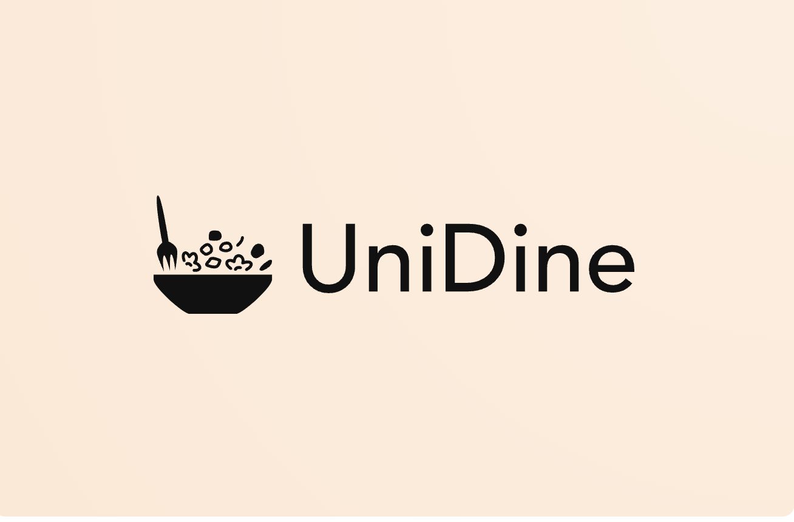

# UniDine


**A food review platform for students, by students.**

## Installation ⬇️

Ensure npm in installed locally on your device by running `npm --version`.

To install all required dependancies, run `npm install`.


## Development 📱

Ensure npm in installed locally on your device by running `npm --version`.

In the working repo directory, run
```
npm install
```
to download all dependancies.

To start the application, run the following commands on separate terminals,
```
npm run startb      // start the backend
npm run startf      // start the frontend
```
Open [http://localhost:3000](http://localhost:3000) to view it in your browser.

## How we built it 💻
- **Frontend**: we used React to create and handle the UI of our web app, with CSS and Material UI being used to provide the style and components of the frontend pages.
- **Backend**: Express.js was used to handle the routes and endpoints for the backend server to interact with the stored data. Typescript was the primary language used to handle server-side logic

## What's next for UniDine 🚀
- Authentication service: The authentication service will be used to verify that the user is a university student, ensuring our product effectively serves the needs of our target audience. Due to time constraints, we were unable to develop a functional authentication service, hence this is the priority for future iterations.
- Popular meals tab: Having a tab on the homepage that shows the highest-rated meals within a time frame (week/month) would allow students to view the past and current popular meals as rated by students on campus. This would allow students to not only discover new food options but also stay up to date with limited-time promotions and offers.
- Expansion to other universities locally and globally.

